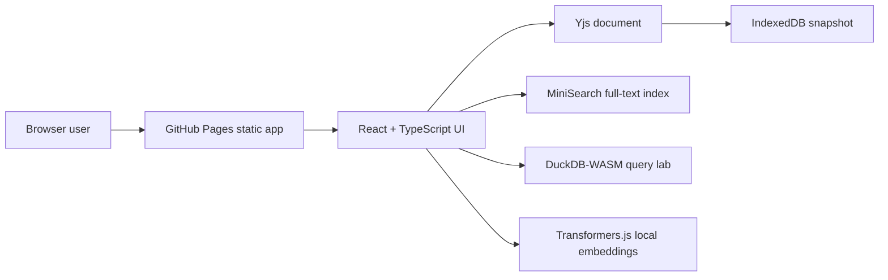

# Roamless Notes

[Live GitHub Pages URL](https://baditaflorin.github.io/roamless-notes/) · [Repository](https://github.com/baditaflorin/roamless-notes) · [Support via PayPal](https://www.paypal.com/paypalme/florinbadita)

Local-first outliner with backlinks, graph search, semantic recall, and optional peer-to-peer sync.

Roamless Notes is a static GitHub Pages app for private, local knowledge work. Notes are stored in the browser with IndexedDB and modeled with Yjs CRDT updates; search, backlinks, graph exploration, DuckDB-WASM SQL, and local Transformer-powered semantic tools all run on the user's device.

## Quickstart

```bash
npm install
make install-hooks
make dev
make test
make build
```

## Architecture



## Commands

- `make dev` starts the Vite dev server.
- `make build` writes the GitHub Pages-ready app into `docs/`.
- `make pages-preview` serves the built app exactly as Pages will.
- `make test` runs unit tests.
- `make smoke` builds and runs the Playwright happy path.
- `make install-hooks` wires `.githooks/` through `core.hooksPath`.

## Documentation

- Architecture: `https://github.com/baditaflorin/roamless-notes/blob/main/docs/architecture.md`
- Deployment: `https://github.com/baditaflorin/roamless-notes/blob/main/docs/deploy.md`
- ADRs: `https://github.com/baditaflorin/roamless-notes/tree/main/docs/adr`
- Privacy: `https://github.com/baditaflorin/roamless-notes/blob/main/docs/privacy.md`
- Postmortem: `https://github.com/baditaflorin/roamless-notes/blob/main/docs/postmortem.md`

## Security

No secrets are needed or stored in the frontend. See `SECURITY.md` for disclosure guidance.
