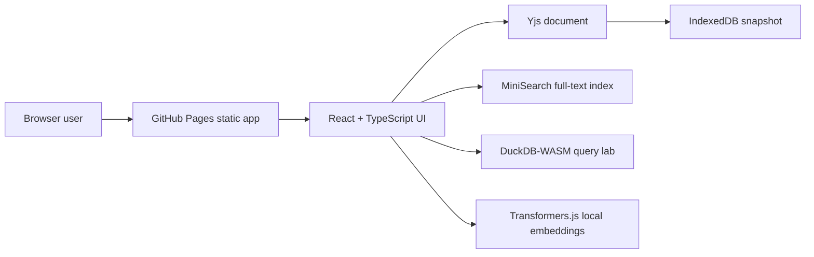

# Roamless Notes

[Live GitHub Pages URL](https://baditaflorin.github.io/roamless-notes/) · [Repository](https://github.com/baditaflorin/roamless-notes) · [Support via PayPal](https://www.paypal.com/paypalme/florinbadita)

Local-first outliner with backlinks, graph search, semantic recall, and portable state.

Roamless Notes is a static GitHub Pages app for private, local knowledge work. Notes are stored in the browser with IndexedDB and modeled with Yjs CRDT updates; import/export, settings, search, backlinks, graph exploration, DuckDB-WASM SQL, and local Transformer-powered semantic tools all run on the user's device.

## Quickstart

```bash
npm install
make install-hooks
make dev
make test
make build
```

## Architecture



## Commands

- `make dev` starts the Vite dev server.
- `make build` writes the GitHub Pages-ready app into `docs/`.
- `make pages-preview` serves the built app exactly as Pages will.
- `make test` runs unit tests.
- `make smoke` builds and runs the Playwright happy path.
- `make install-hooks` wires `.githooks/` through `core.hooksPath`.

## Verified Features

- Import real notes from JSON, Markdown, plain text, HTML, paste, clipboard, drag/drop, URL fetch when CORS allows it, or a small share URL.
- Export everything as full Roamless JSON, Markdown, or CSV.
- Copy Markdown, selected blocks, SQL rows, semantic summaries, and small share links.
- Print or save to PDF through the browser print flow.
- Persist notes, selected block, and settings across reloads.
- Edit nested blocks, indent/outdent, reorder, search, query, inspect backlinks, and use the graph view.
- Run DuckDB-WASM SQL locally against the block table.
- Run semantic search/summarization locally after an explicit model-loading action.

## Import And Export

Use the workspace import panel for `.json`, `.md`, `.markdown`, `.txt`, and `.html` files. Multiple files import as separate roots. Full Roamless JSON can replace the workspace when the replace checkbox is enabled; otherwise it appends.

State files use schema version 2 and include blocks, selected block, settings, and export time. Older v1 block-only exports are migrated on import.

## Limitations

- Live peer-to-peer sync is not shipped in v1; use JSON/share export to move state between browsers.
- URL import depends on the target site's CORS policy. If fetch is blocked, paste rendered text or HTML.
- Browser-local Transformer models are large and load only after the user starts a semantic action.
- No image OCR, attachments, folder import, accounts, hosted API, or collaboration.

## Documentation

- Architecture: `https://github.com/baditaflorin/roamless-notes/blob/main/docs/architecture.md`
- Deployment: `https://github.com/baditaflorin/roamless-notes/blob/main/docs/deploy.md`
- ADRs: `https://github.com/baditaflorin/roamless-notes/tree/main/docs/adr`
- Privacy: `https://github.com/baditaflorin/roamless-notes/blob/main/docs/privacy.md`
- Postmortem: `https://github.com/baditaflorin/roamless-notes/blob/main/docs/postmortem.md`

## Security

No secrets are needed or stored in the frontend. See `SECURITY.md` for disclosure guidance.
