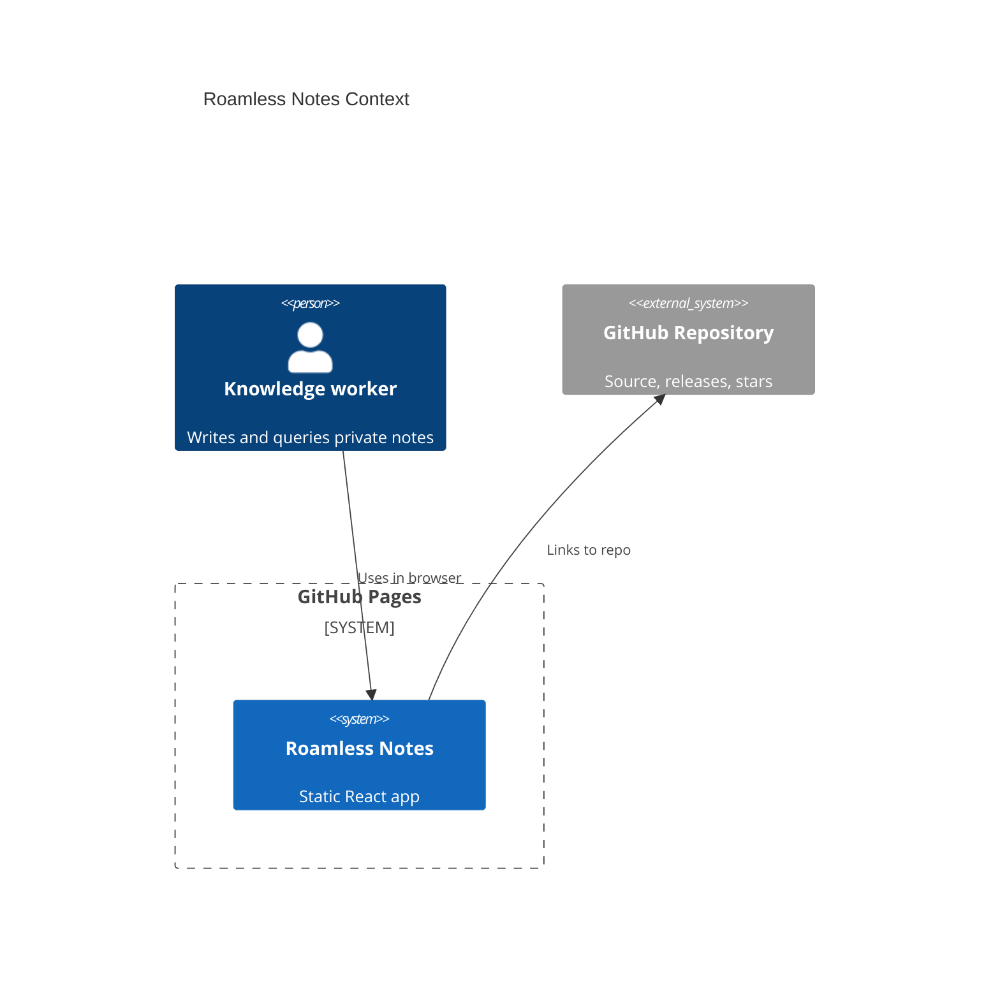
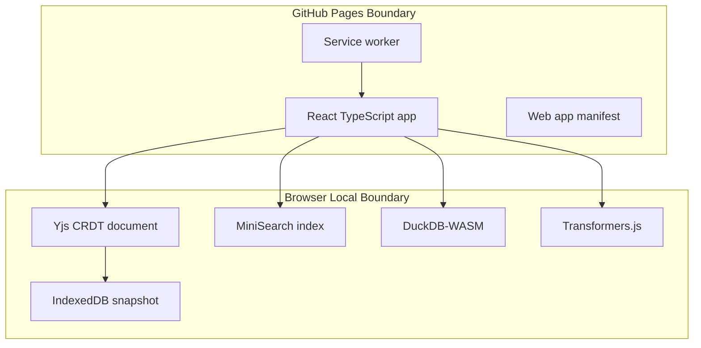

# Architecture

Roamless Notes is a Mode A GitHub Pages application.

## Module Boundaries

- `src/features/notes` owns CRDT state, persistence, and block editing.
- `src/features/search` owns full-text indexing.
- `src/features/query` owns the compact query language.
- `src/features/graph` owns graph derivation and SVG rendering.
- `src/features/semantic` owns lazy local model loading.
- `src/features/duckdb` owns lazy DuckDB-WASM initialization.
- `src/features/workspace` owns import parsing, export formatting, and workspace schema migration.
- `src/lib/browserIo.ts` owns browser download, clipboard, and share URL helpers.
